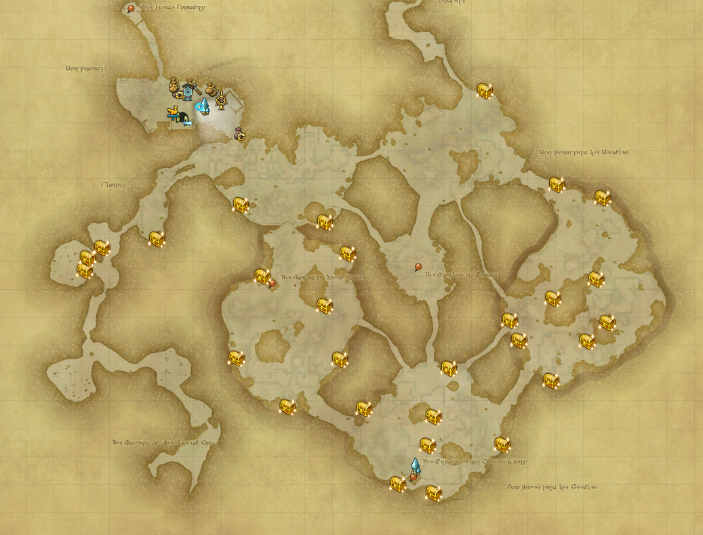
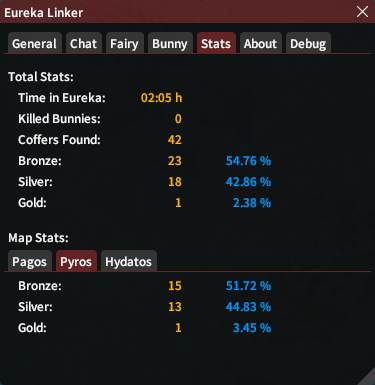
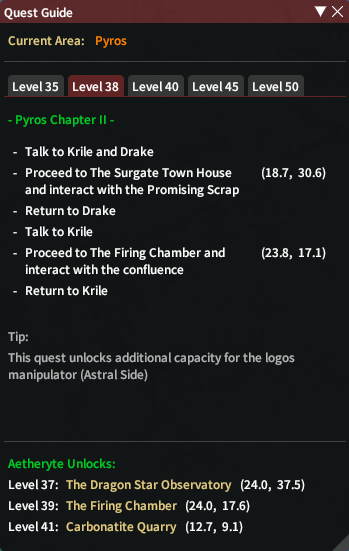
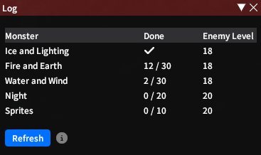
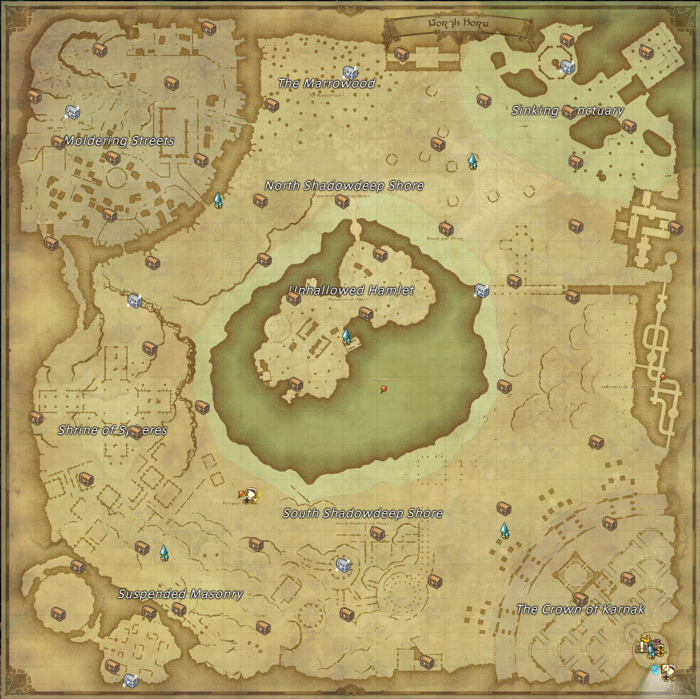
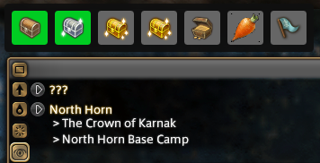
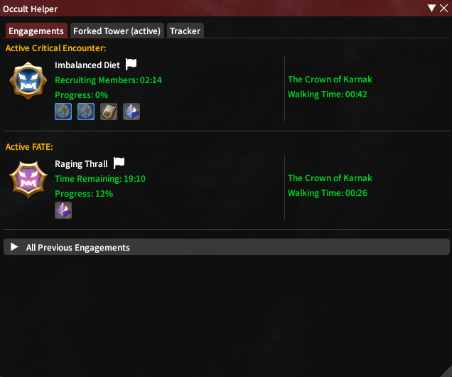
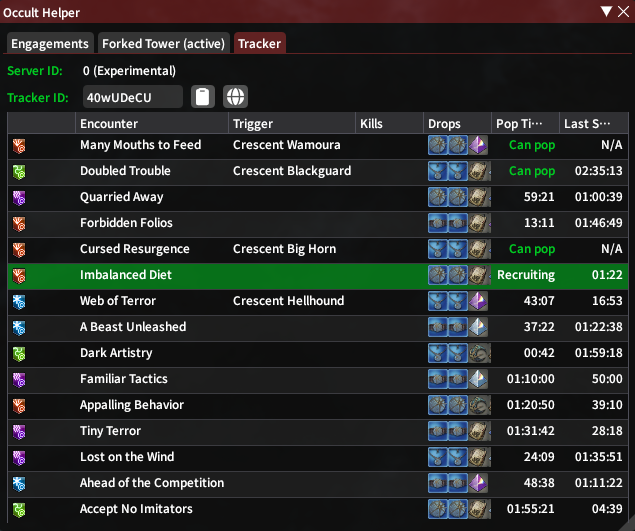

# Eureka Linker
A simple tracker for Eureka, and Occult.
Other Features:
- Fairy Finder
- Bunny Timer Window
- Bunny Coffer Helper
- Stats
- Quest Guide (clickable coords)
- Localized (DE, FR, JA)

Occult:
- Random Treasure Proximity Notification
- Bunny Carrot Proximity Notification
- Pot Coffer Helper
- Pot Timer Window
- Map Markers For Treasure, Bunny, Pot, Survey Points
- Occult Tracker

Website (https://tracker.xivstats.com/):
- A simple tracker for occult
- Players don't need the plugin to enjoy the benefits

## Eureka

Eureka Information

### Coffer Map Marker

### Stats

### Quest Guide

### Log

## Occult

Occult Information

### Coffer Map

### Fast Switch Overlay

### /elo

### Tracker

## Website

